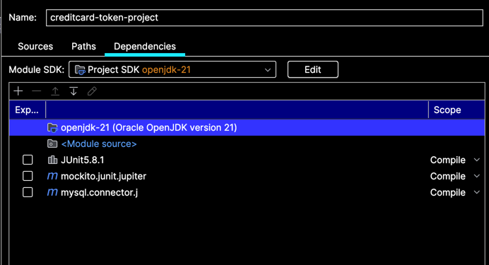

# Project Name

CreditCard Token Project

## Overview

Customers enter their credit card information which is then tokenized and saved to the database. Customers also chose a
payment processor that they would like to use. Customers will also want to move the credit card information from one
payment processor to another.

## Table of Contents

- [Prerequisites](#prerequisites)
- [Installation](#installation)
- [Testing](#testing)
- [Contributing](#contributing)
- [License](#license)

### Prerequisites

- Java 21
- MySQL 8.0
- JUnit 5

### Installation

```bash
git clone https://github.com/sdanyalk/creditcard-token-project.git
cd creditcard-token-project
```

### Testing

- The following dependencies need to be added to the project

